# Reachy Mini 系统架构图表

本文档包含了 Reachy Mini 系统的各种架构图表，帮助理解系统的整体结构和组件关系。

## 1. 系统总体架构图

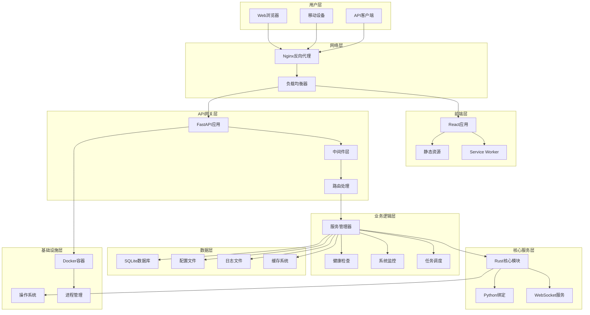

## 2. 组件交互图

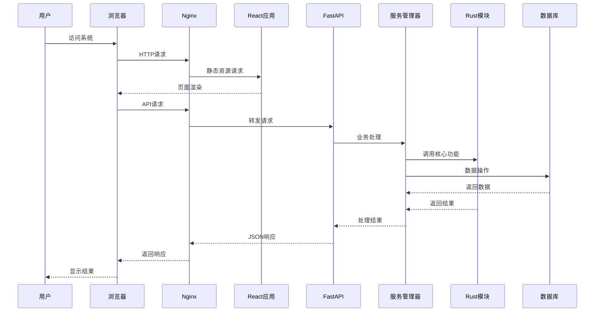

## 3. 数据流图

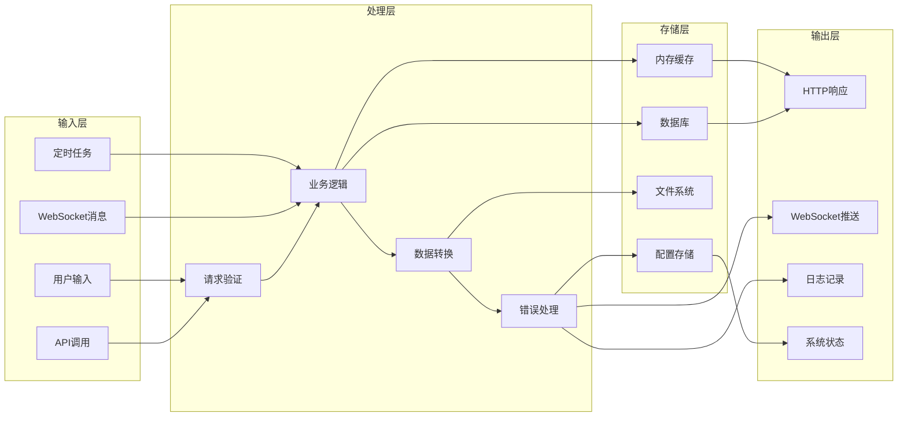

## 4. 服务依赖图

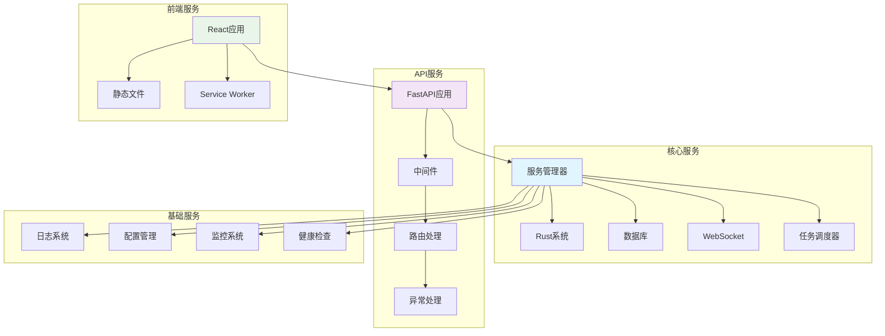

## 5. 部署架构图

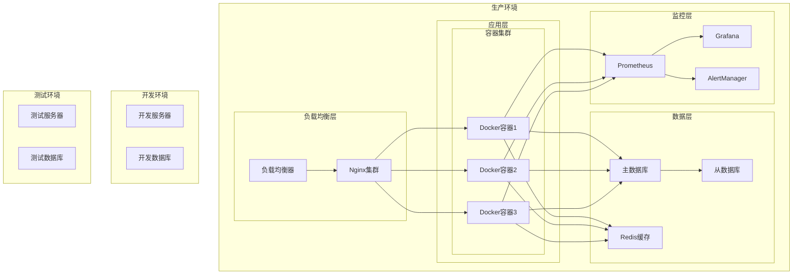

## 6. 网络拓扑图

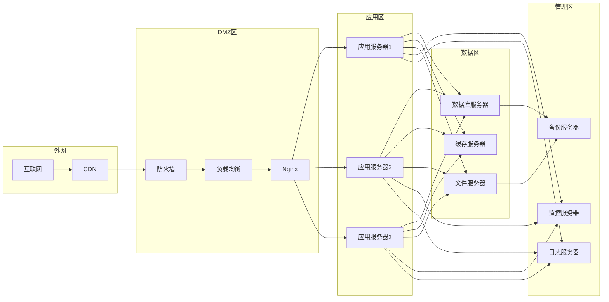

## 7. 状态机图

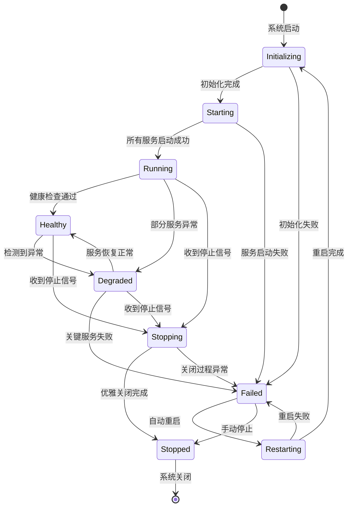

## 8. 组件生命周期图

```mermaid
gantt
    title 系统组件启动时序图
    dateFormat X
    axisFormat %s
    
    section 基础组件
    配置加载        :done, config, 0, 1s
    日志系统        :done, logging, 1s, 2s
    
    section 核心服务
    数据库连接      :done, database, 2s, 4s
    Rust模块初始化  :done, rust, 3s, 6s
    
    section 应用服务
    FastAPI启动     :done, fastapi, 6s, 8s
    WebSocket服务   :done, websocket, 8s, 10s
    任务调度器      :done, scheduler, 10s, 12s
    
    section 前端服务
    静态文件服务    :done, static, 12s, 13s
    React应用就绪   :done, react, 13s, 14s
    
    section 监控服务
    健康检查        :done, health, 14s, 15s
    系统监控        :done, monitor, 15s, 16s
```

## 9. 错误处理流程图

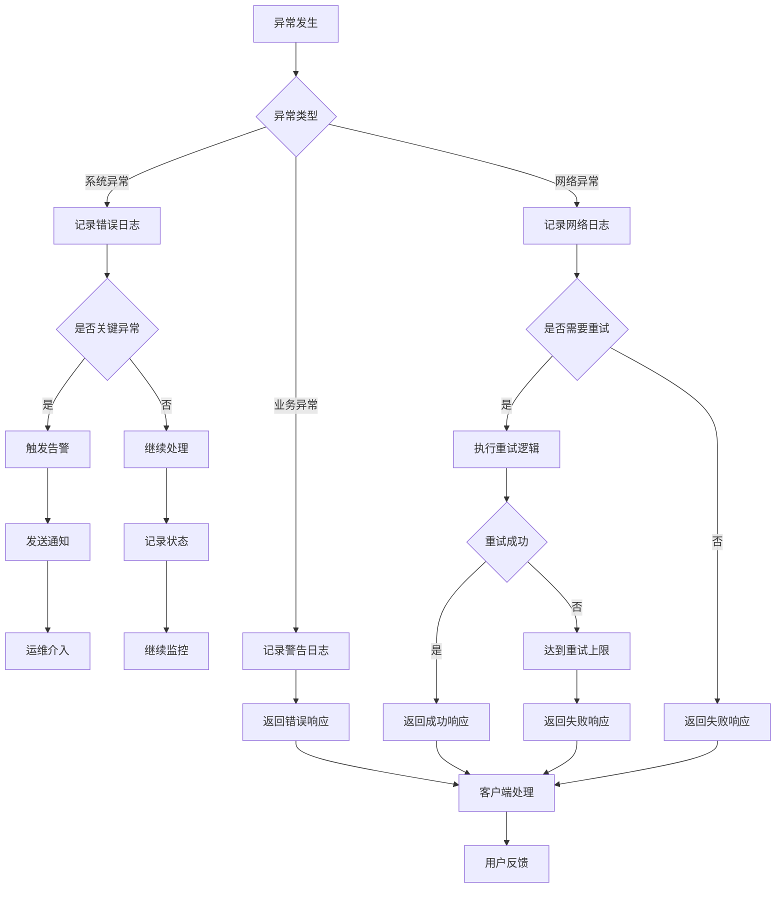

## 10. 性能监控架构图

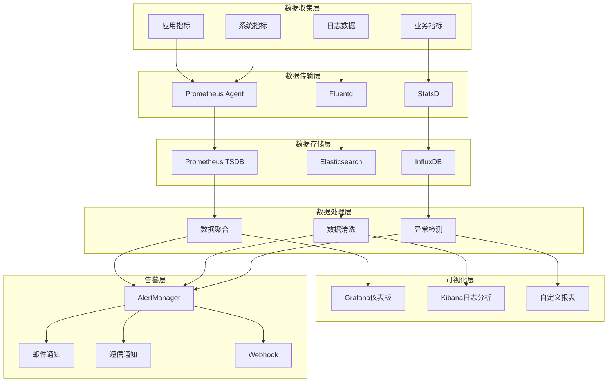

## 11. 安全架构图

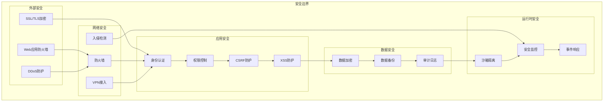

## 12. 扩展性架构图

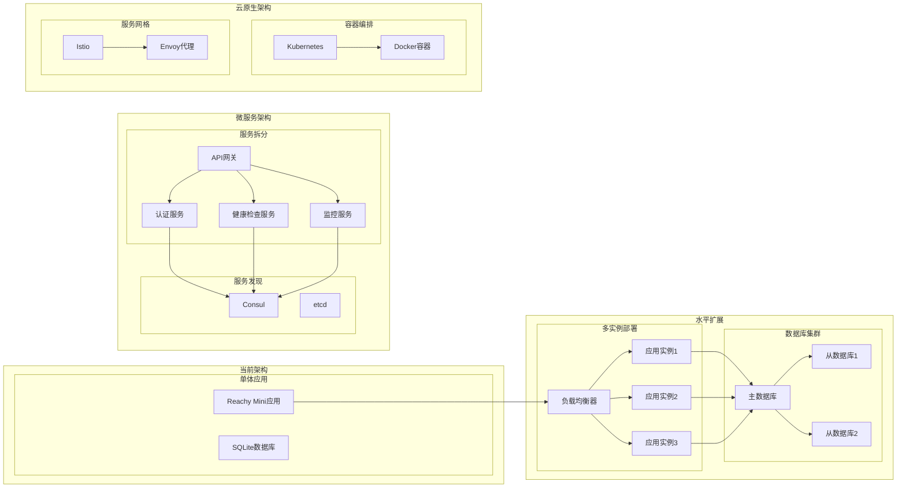

## 图表说明

### 图表类型说明

1. **系统总体架构图**: 展示了系统的分层架构和各层之间的关系
2. **组件交互图**: 描述了用户请求的完整处理流程
3. **数据流图**: 展示了数据在系统中的流转过程
4. **服务依赖图**: 显示了各个服务组件之间的依赖关系
5. **部署架构图**: 描述了系统在不同环境中的部署结构
6. **网络拓扑图**: 展示了网络层面的架构设计
7. **状态机图**: 描述了系统的各种状态和状态转换
8. **组件生命周期图**: 展示了系统启动时各组件的启动顺序和时间
9. **错误处理流程图**: 描述了系统的错误处理机制
10. **性能监控架构图**: 展示了系统监控和告警的架构
11. **安全架构图**: 描述了系统的安全防护体系
12. **扩展性架构图**: 展示了系统的扩展演进路径

### 使用建议

- **开发阶段**: 重点关注组件交互图和数据流图
- **部署阶段**: 重点关注部署架构图和网络拓扑图
- **运维阶段**: 重点关注性能监控架构图和错误处理流程图
- **扩展阶段**: 重点关注扩展性架构图

### 图表更新

这些图表应该随着系统的演进而更新，建议：

1. **定期审查**: 每个版本发布后审查图表的准确性
2. **及时更新**: 架构变更时及时更新相关图表
3. **版本控制**: 将图表纳入版本控制系统
4. **文档同步**: 确保图表与技术文档保持同步

通过这些架构图表，可以更好地理解 Reachy Mini 系统的整体设计和各组件之间的关系，为系统的开发、部署、运维和扩展提供重要参考。