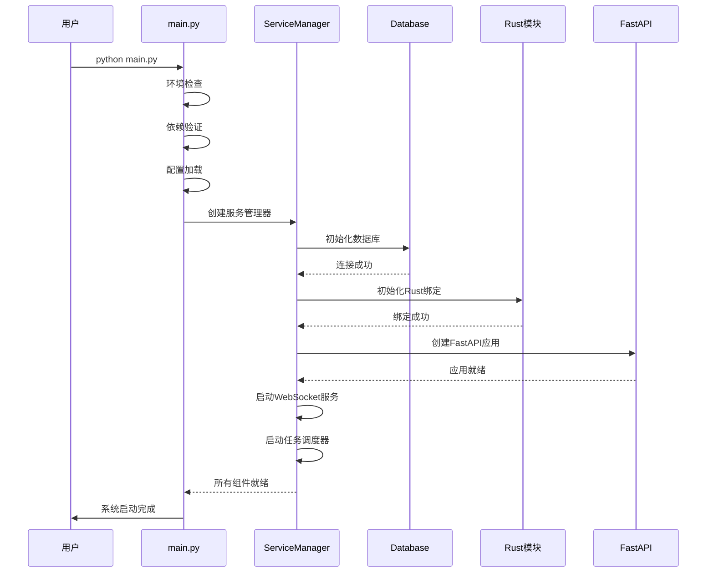
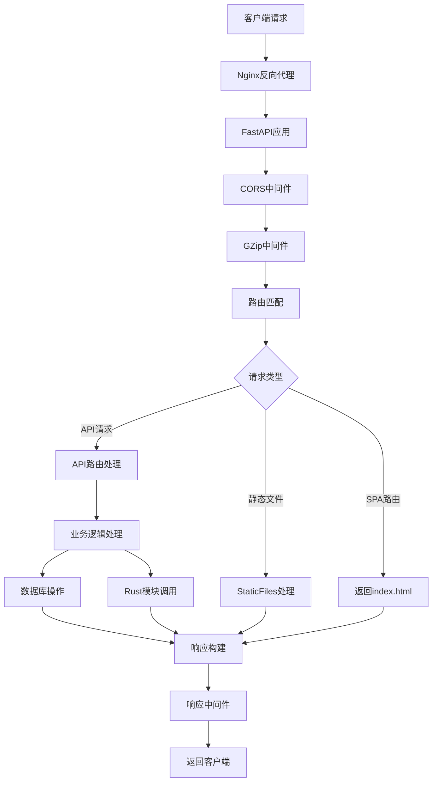
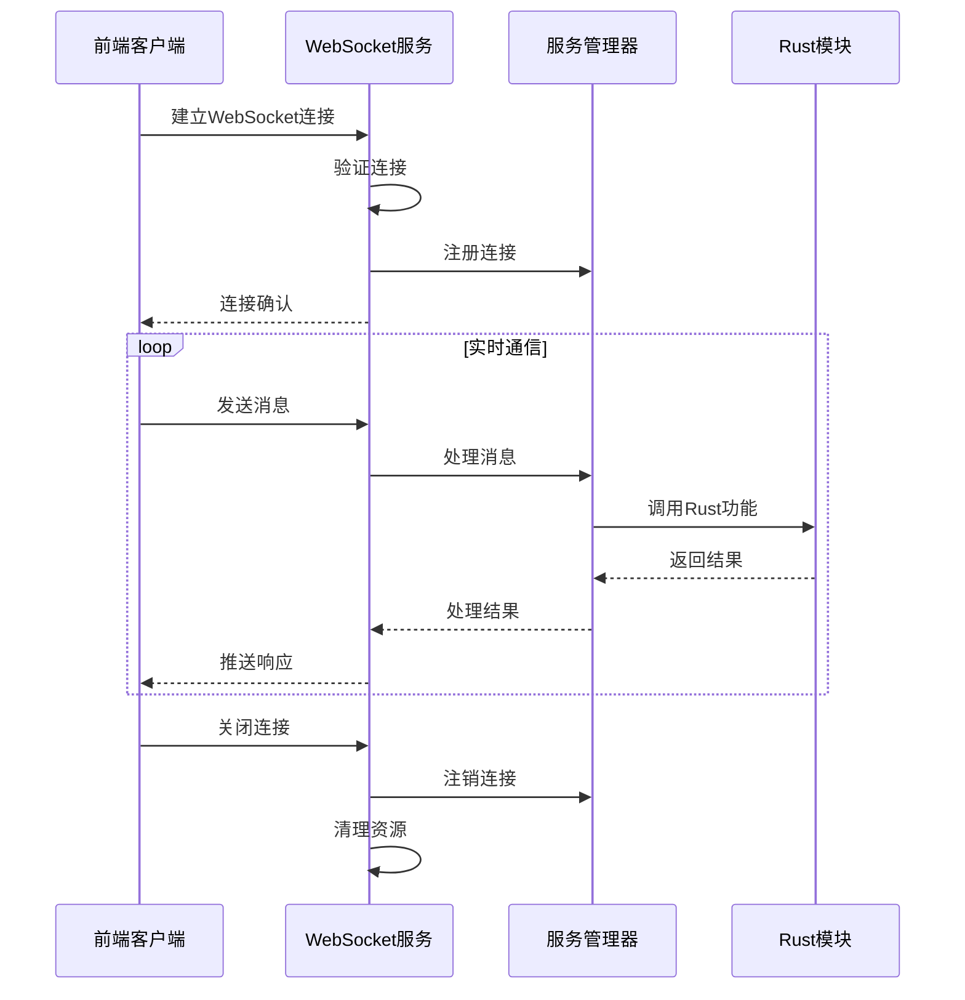
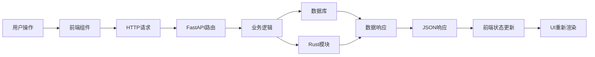

# Reachy Mini 运行逻辑和操作流程

## 概述

本文档详细描述了 Reachy Mini 系统的运行逻辑、操作流程和各组件之间的交互关系，帮助理解系统的工作原理和故障排查。

## 系统启动流程

### 1. 系统初始化阶段



### 2. 详细启动步骤

#### 阶段1: 环境准备
```python
# 1. 检查Python版本和依赖
setup_environment()
check_dependencies()
validate_system_config()

# 2. 设置日志系统
logging.basicConfig(
    level=logging.INFO,
    format='%(asctime)s - %(name)s - %(levelname)s - %(message)',
    handlers=[
        logging.StreamHandler(sys.stdout),
        logging.FileHandler('logs/reachy_mini.log')
    ]
)
```

#### 阶段2: 服务管理器初始化
```python
# 3. 创建服务管理器实例
service_manager = ServiceManager()

# 4. 按顺序初始化各个组件
await service_manager.initialize()
```

#### 阶段3: 组件启动顺序
1. **数据库连接** (`_initialize_database`)
   - 建立数据库连接
   - 执行健康检查
   - 运行数据库迁移
   - 更新组件状态

2. **Rust模块绑定** (`_initialize_rust_bindings`)
   - 检查Rust模块可用性
   - 创建配置对象
   - 初始化Rust系统
   - 验证绑定状态

3. **FastAPI应用** (`_initialize_api_server`)
   - 创建FastAPI实例
   - 设置中间件
   - 注册路由
   - 配置静态文件服务

4. **WebSocket服务** (`_initialize_websocket`)
   - 建立WebSocket连接管理
   - 设置消息处理器
   - 启动连接监听

5. **任务调度器** (`_initialize_scheduler`)
   - 初始化后台任务
   - 设置定时任务
   - 启动调度循环

## 请求处理流程

### HTTP API 请求流程



### WebSocket 连接流程



## 核心API端点详解

### 1. 健康检查端点 (`/api/health`)

**功能**: 返回系统整体健康状态

**处理流程**:
```python
@app.get("/api/health")
async def health_check():
    # 1. 获取服务管理器实例
    service_manager = get_service_manager()
    
    # 2. 收集各组件状态
    status = service_manager.get_status()
    
    # 3. 构建响应数据
    return {
        "status": "healthy" if status["running"] else "unhealthy",
        "timestamp": status.get("uptime", 0),
        "components": status["components"],
        "config": status["config"]
    }
```

**响应示例**:
```json
{
  "status": "healthy",
  "timestamp": 1703123456,
  "components": {
    "database": true,
    "rust_bindings": true,
    "api_server": true,
    "websocket": true,
    "scheduler": true
  },
  "config": {
    "api_host": "0.0.0.0",
    "api_port": 8000,
    "debug": true
  }
}
```

### 2. 系统信息端点 (`/system/info`)

**功能**: 返回详细的系统配置和环境信息

**处理流程**:
```python
@app.get("/system/info")
async def system_info():
    # 1. 收集服务管理器状态
    service_manager = get_service_manager()
    info = {"service_manager": service_manager.get_status()}
    
    # 2. 添加系统配置信息
    info["config"] = {
        "api_host": config.api_host,
        "api_port": config.api_port,
        "debug": config.debug,
        "database_url": "..."
    }
    
    # 3. 添加Python环境信息
    info["python"] = {
        "version": sys.version,
        "platform": sys.platform
    }
    
    # 4. 检查并添加Rust模块信息
    if is_rust_available():
        info["rust"] = get_rust_system_info()
    
    return info
```

### 3. 系统状态端点 (`/system/status`)

**功能**: 返回实时系统运行状态

**数据结构**:
```python
{
    "running": bool,           # 系统是否运行中
    "uptime": int,             # 运行时间（秒）
    "components": {            # 各组件状态
        "database": bool,
        "rust_bindings": bool,
        "api_server": bool,
        "websocket": bool,
        "scheduler": bool
    },
    "config": {...},          # 配置信息
    "stats": {                # 统计信息
        "requests_count": int,
        "active_connections": int,
        "memory_usage": float
    }
}
```

## 前端应用逻辑

### 1. 应用初始化

```typescript
// App.tsx 主应用组件
function App() {
  // 状态管理
  const [currentPath, setCurrentPath] = useState(window.location.pathname)
  const [systemInfo, setSystemInfo] = useState(null)
  const [loading, setLoading] = useState(true)
  
  // 监听路由变化
  useEffect(() => {
    const handlePopState = () => {
      setCurrentPath(window.location.pathname)
    }
    window.addEventListener('popstate', handlePopState)
    return () => window.removeEventListener('popstate', handlePopState)
  }, [])
  
  // 获取系统信息
  useEffect(() => {
    fetchSystemInfo()
  }, [])
}
```

### 2. 健康检查页面逻辑

```typescript
// HealthCheck.tsx 健康检查组件
function HealthCheck() {
  // 状态管理
  const [healthData, setHealthData] = useState(null)
  const [loading, setLoading] = useState(true)
  const [error, setError] = useState(null)
  
  // 数据获取
  const fetchHealthData = async () => {
    try {
      const response = await fetch('/api/health')
      const data = await response.json()
      setHealthData(data)
      setError(null)
    } catch (err) {
      setError(err.message)
    } finally {
      setLoading(false)
    }
  }
  
  // 自动刷新机制
  useEffect(() => {
    fetchHealthData()  // 立即获取
    const interval = setInterval(fetchHealthData, 10000)  // 10秒刷新
    return () => clearInterval(interval)
  }, [])
}
```

### 3. 路由处理逻辑

```typescript
// 路由映射
const routeComponents = {
  '/': () => <div>主页</div>,
  '/health': () => <HealthCheck />,
  '/status': () => <SystemStatus />,
  '/docs': () => window.location.href = '/docs'
}

// 路由渲染
const renderCurrentRoute = () => {
  const Component = routeComponents[currentPath] || (() => <div>404</div>)
  return <Component />
}
```

## 数据流和状态管理

### 1. 数据流向图



### 2. 状态同步机制

#### 前端状态管理
```typescript
// 全局状态（通过Context或状态管理库）
interface AppState {
  systemInfo: SystemInfo | null
  healthStatus: HealthStatus | null
  loading: boolean
  error: string | null
  lastUpdate: Date
}

// 状态更新函数
const updateSystemState = (newData: Partial<AppState>) => {
  setState(prevState => ({
    ...prevState,
    ...newData,
    lastUpdate: new Date()
  }))
}
```

#### 后端状态管理
```python
# 服务管理器状态
class ServiceManager:
    def __init__(self):
        self._components_status = {
            "database": False,
            "rust_bindings": False,
            "api_server": False,
            "websocket": False,
            "scheduler": False,
        }
        self._running = False
        self._start_time = None
    
    def get_status(self) -> Dict[str, Any]:
        return {
            "running": self._running,
            "uptime": time.time() - self._start_time if self._start_time else 0,
            "components": self._components_status.copy(),
            "config": self._get_config_info()
        }
```

## 错误处理和恢复机制

### 1. 错误分类

#### 系统级错误
- **启动失败**: 组件初始化错误
- **连接错误**: 数据库连接失败
- **绑定错误**: Rust模块加载失败

#### 运行时错误
- **API错误**: 请求处理异常
- **数据错误**: 数据验证失败
- **网络错误**: 连接超时或中断

### 2. 错误处理策略

#### 后端错误处理
```python
# 全局异常处理器
@app.exception_handler(Exception)
async def global_exception_handler(request: Request, exc: Exception):
    logger.error(f"未处理的异常: {exc}", exc_info=True)
    return JSONResponse(
        status_code=500,
        content={
            "error": "内部服务器错误",
            "message": str(exc) if config.debug else "请联系管理员",
            "timestamp": time.time()
        }
    )

# 业务异常处理
class ReachyMiniException(Exception):
    def __init__(self, message: str, code: str = "UNKNOWN"):
        self.message = message
        self.code = code
        super().__init__(message)

@app.exception_handler(ReachyMiniException)
async def business_exception_handler(request: Request, exc: ReachyMiniException):
    return JSONResponse(
        status_code=400,
        content={
            "error": exc.code,
            "message": exc.message,
            "timestamp": time.time()
        }
    )
```

#### 前端错误处理
```typescript
// 错误边界组件
class ErrorBoundary extends React.Component {
  constructor(props) {
    super(props)
    this.state = { hasError: false, error: null }
  }
  
  static getDerivedStateFromError(error) {
    return { hasError: true, error }
  }
  
  componentDidCatch(error, errorInfo) {
    console.error('应用错误:', error, errorInfo)
    // 可以发送错误报告到服务器
  }
  
  render() {
    if (this.state.hasError) {
      return (
        <div className="error-fallback">
          <h2>出现了一些问题</h2>
          <p>{this.state.error?.message}</p>
          <button onClick={() => window.location.reload()}>
            刷新页面
          </button>
        </div>
      )
    }
    return this.props.children
  }
}

// API调用错误处理
const fetchWithErrorHandling = async (url: string, options?: RequestInit) => {
  try {
    const response = await fetch(url, options)
    if (!response.ok) {
      throw new Error(`HTTP ${response.status}: ${response.statusText}`)
    }
    return await response.json()
  } catch (error) {
    console.error('API调用失败:', error)
    throw error
  }
}
```

### 3. 自动恢复机制

#### 重试策略
```python
# 指数退避重试
import asyncio
from functools import wraps

def retry_with_backoff(max_retries=3, base_delay=1):
    def decorator(func):
        @wraps(func)
        async def wrapper(*args, **kwargs):
            for attempt in range(max_retries):
                try:
                    return await func(*args, **kwargs)
                except Exception as e:
                    if attempt == max_retries - 1:
                        raise
                    delay = base_delay * (2 ** attempt)
                    logger.warning(f"第{attempt + 1}次尝试失败，{delay}秒后重试: {e}")
                    await asyncio.sleep(delay)
        return wrapper
    return decorator

@retry_with_backoff(max_retries=3)
async def connect_to_database():
    # 数据库连接逻辑
    pass
```

#### 健康检查和自愈
```python
# 定期健康检查
class HealthChecker:
    def __init__(self, service_manager):
        self.service_manager = service_manager
        self.check_interval = 30  # 30秒检查一次
    
    async def start_health_check(self):
        while True:
            try:
                await self.check_all_components()
                await asyncio.sleep(self.check_interval)
            except Exception as e:
                logger.error(f"健康检查失败: {e}")
    
    async def check_all_components(self):
        status = self.service_manager.get_status()
        
        # 检查各组件状态
        for component, is_healthy in status["components"].items():
            if not is_healthy:
                logger.warning(f"组件 {component} 不健康，尝试重启")
                await self.restart_component(component)
    
    async def restart_component(self, component: str):
        # 组件重启逻辑
        pass
```

## 性能优化策略

### 1. 后端优化

#### 异步处理
```python
# 使用异步数据库操作
from sqlalchemy.ext.asyncio import create_async_engine, AsyncSession

engine = create_async_engine(DATABASE_URL)

async def get_data_async():
    async with AsyncSession(engine) as session:
        result = await session.execute(select(Model))
        return result.scalars().all()

# 并发处理多个任务
async def process_multiple_requests():
    tasks = [
        fetch_data_from_api(),
        query_database(),
        call_rust_function()
    ]
    results = await asyncio.gather(*tasks)
    return results
```

#### 缓存策略
```python
# 内存缓存
from functools import lru_cache
from typing import Dict, Any
import time

class CacheManager:
    def __init__(self):
        self._cache: Dict[str, tuple] = {}  # (data, timestamp)
        self._ttl = 300  # 5分钟TTL
    
    def get(self, key: str) -> Any:
        if key in self._cache:
            data, timestamp = self._cache[key]
            if time.time() - timestamp < self._ttl:
                return data
            else:
                del self._cache[key]
        return None
    
    def set(self, key: str, data: Any):
        self._cache[key] = (data, time.time())

# 使用装饰器缓存
@lru_cache(maxsize=128)
def expensive_computation(param: str) -> str:
    # 耗时计算
    return result
```

### 2. 前端优化

#### 组件优化
```typescript
// 使用React.memo避免不必要的重渲染
const HealthStatus = React.memo(({ status }: { status: HealthStatus }) => {
  return (
    <div className="health-status">
      <span className={`status-indicator ${status.status}`}>
        {status.status}
      </span>
    </div>
  )
})

// 使用useMemo缓存计算结果
const ComponentList = ({ components }: { components: Record<string, boolean> }) => {
  const sortedComponents = useMemo(() => {
    return Object.entries(components)
      .sort(([a], [b]) => a.localeCompare(b))
      .map(([name, status]) => ({ name, status }))
  }, [components])
  
  return (
    <ul>
      {sortedComponents.map(({ name, status }) => (
        <li key={name}>
          {name}: {status ? '✅' : '❌'}
        </li>
      ))}
    </ul>
  )
}

// 使用useCallback避免函数重新创建
const HealthCheck = () => {
  const [data, setData] = useState(null)
  
  const fetchData = useCallback(async () => {
    const response = await fetch('/api/health')
    const result = await response.json()
    setData(result)
  }, [])
  
  useEffect(() => {
    fetchData()
    const interval = setInterval(fetchData, 10000)
    return () => clearInterval(interval)
  }, [fetchData])
}
```

#### 资源优化
```typescript
// 懒加载组件
const LazyHealthCheck = React.lazy(() => import('./components/HealthCheck'))

function App() {
  return (
    <Suspense fallback={<div>加载中...</div>}>
      <LazyHealthCheck />
    </Suspense>
  )
}

// 图片优化
const OptimizedImage = ({ src, alt }: { src: string, alt: string }) => {
  return (
    
  )
}
```

## 监控和日志

### 1. 日志系统

#### 结构化日志
```python
import structlog
from structlog import get_logger

# 配置结构化日志
structlog.configure(
    processors=[
        structlog.stdlib.filter_by_level,
        structlog.stdlib.add_logger_name,
        structlog.stdlib.add_log_level,
        structlog.stdlib.PositionalArgumentsFormatter(),
        structlog.processors.TimeStamper(fmt="iso"),
        structlog.processors.StackInfoRenderer(),
        structlog.processors.format_exc_info,
        structlog.processors.UnicodeDecoder(),
        structlog.processors.JSONRenderer()
    ],
    context_class=dict,
    logger_factory=structlog.stdlib.LoggerFactory(),
    wrapper_class=structlog.stdlib.BoundLogger,
    cache_logger_on_first_use=True,
)

logger = get_logger()

# 使用结构化日志
logger.info(
    "API请求处理",
    method="GET",
    path="/api/health",
    status_code=200,
    response_time=0.123,
    user_id="user123"
)
```

#### 日志轮转
```python
from logging.handlers import RotatingFileHandler

# 设置日志轮转
file_handler = RotatingFileHandler(
    'logs/reachy_mini.log',
    maxBytes=10*1024*1024,  # 10MB
    backupCount=5
)
file_handler.setFormatter(
    logging.Formatter('%(asctime)s - %(name)s - %(levelname)s - %(message)s')
)
logger.addHandler(file_handler)
```

### 2. 性能监控

#### 请求追踪
```python
import time
from functools import wraps

def track_performance(func):
    @wraps(func)
    async def wrapper(*args, **kwargs):
        start_time = time.time()
        try:
            result = await func(*args, **kwargs)
            duration = time.time() - start_time
            logger.info(
                "函数执行完成",
                function=func.__name__,
                duration=duration,
                status="success"
            )
            return result
        except Exception as e:
            duration = time.time() - start_time
            logger.error(
                "函数执行失败",
                function=func.__name__,
                duration=duration,
                error=str(e),
                status="error"
            )
            raise
    return wrapper

@track_performance
async def expensive_operation():
    # 耗时操作
    pass
```

#### 系统指标收集
```python
import psutil
import asyncio

class SystemMetrics:
    def __init__(self):
        self.metrics = {}
    
    async def collect_metrics(self):
        while True:
            self.metrics.update({
                "cpu_percent": psutil.cpu_percent(),
                "memory_percent": psutil.virtual_memory().percent,
                "disk_usage": psutil.disk_usage('/').percent,
                "active_connections": len(psutil.net_connections()),
                "timestamp": time.time()
            })
            
            logger.info("系统指标", **self.metrics)
            await asyncio.sleep(60)  # 每分钟收集一次
    
    def get_current_metrics(self):
        return self.metrics.copy()
```

## 部署和运维

### 1. 部署流程

#### 开发环境部署
```bash
#!/bin/bash
# deploy_dev.sh

set -e

echo "🚀 开始部署开发环境..."

# 1. 检查环境
echo "检查Python环境..."
python3 --version
echo "检查Node.js环境..."
node --version
echo "检查Rust环境..."
rustc --version

# 2. 安装Python依赖
echo "安装Python依赖..."
cd backend/python
python3 -m venv venv
source venv/bin/activate
pip install -r requirements.txt

# 3. 构建Rust模块
echo "构建Rust模块..."
cd ../rust
cargo build --release

# 4. 安装前端依赖
echo "安装前端依赖..."
cd ../../frontend
npm install

# 5. 构建前端
echo "构建前端..."
npm run build

# 6. 启动服务
echo "启动开发服务器..."
cd ../backend/python
source venv/bin/activate
python main.py

echo "✅ 开发环境部署完成！"
echo "访问地址: http://localhost:8000"
```

#### 生产环境部署
```bash
#!/bin/bash
# deploy_prod.sh

set -e

echo "🚀 开始生产环境部署..."

# 1. 拉取最新代码
git pull origin main

# 2. 构建应用
docker-compose build

# 3. 停止旧服务
docker-compose down

# 4. 启动新服务
docker-compose up -d

# 5. 健康检查
echo "等待服务启动..."
sleep 10

if curl -f http://localhost:8000/api/health; then
    echo "✅ 服务启动成功！"
else
    echo "❌ 服务启动失败！"
    docker-compose logs
    exit 1
fi

echo "🎉 生产环境部署完成！"
```

### 2. 监控和告警

#### 健康检查脚本
```bash
#!/bin/bash
# health_check.sh

HEALTH_URL="http://localhost:8000/api/health"
MAX_RETRIES=3
RETRY_DELAY=5

for i in $(seq 1 $MAX_RETRIES); do
    if curl -f -s $HEALTH_URL > /dev/null; then
        echo "✅ 服务健康检查通过"
        exit 0
    else
        echo "❌ 健康检查失败，第 $i 次重试..."
        if [ $i -lt $MAX_RETRIES ]; then
            sleep $RETRY_DELAY
        fi
    fi
done

echo "❌ 服务健康检查失败，达到最大重试次数"
exit 1
```

#### 系统监控脚本
```python
#!/usr/bin/env python3
# monitor.py

import requests
import time
import smtplib
from email.mime.text import MIMEText

class SystemMonitor:
    def __init__(self):
        self.health_url = "http://localhost:8000/api/health"
        self.alert_threshold = 3  # 连续失败3次后告警
        self.failure_count = 0
    
    def check_health(self):
        try:
            response = requests.get(self.health_url, timeout=10)
            if response.status_code == 200:
                data = response.json()
                if data.get("status") == "healthy":
                    self.failure_count = 0
                    return True
            return False
        except Exception as e:
            print(f"健康检查异常: {e}")
            return False
    
    def send_alert(self, message):
        # 发送告警邮件或通知
        print(f"🚨 告警: {message}")
        # 实际实现中可以发送邮件、短信或推送通知
    
    def run_monitor(self):
        while True:
            if not self.check_health():
                self.failure_count += 1
                print(f"健康检查失败，失败次数: {self.failure_count}")
                
                if self.failure_count >= self.alert_threshold:
                    self.send_alert(f"系统连续{self.failure_count}次健康检查失败")
            else:
                print("系统运行正常")
            
            time.sleep(60)  # 每分钟检查一次

if __name__ == "__main__":
    monitor = SystemMonitor()
    monitor.run_monitor()
```

## 故障排查指南

### 1. 常见问题和解决方案

#### 系统启动失败
```bash
# 检查日志
tail -f logs/reachy_mini.log

# 检查端口占用
lsof -i :8000

# 检查进程状态
ps aux | grep python

# 检查系统资源
free -h
df -h
```

#### 数据库连接问题
```python
# 测试数据库连接
import sqlite3

try:
    conn = sqlite3.connect('data/reachy_mini.db')
    cursor = conn.cursor()
    cursor.execute('SELECT 1')
    print("数据库连接正常")
except Exception as e:
    print(f"数据库连接失败: {e}")
finally:
    if conn:
        conn.close()
```

#### Rust模块加载失败
```bash
# 检查Rust模块
cd backend/rust
cargo check
cargo test

# 重新构建
cargo clean
cargo build --release

# 检查Python绑定
cd ../python
python -c "import rust_bindings; print('Rust模块加载成功')"
```

### 2. 性能问题诊断

#### CPU使用率过高
```bash
# 查看CPU使用情况
top -p $(pgrep -f "python main.py")

# 使用py-spy分析Python性能
py-spy top --pid $(pgrep -f "python main.py")

# 生成火焰图
py-spy record -o profile.svg --pid $(pgrep -f "python main.py") --duration 60
```

#### 内存泄漏检测
```python
# memory_profiler.py
import tracemalloc
import asyncio

async def monitor_memory():
    tracemalloc.start()
    
    while True:
        current, peak = tracemalloc.get_traced_memory()
        print(f"当前内存使用: {current / 1024 / 1024:.1f} MB")
        print(f"峰值内存使用: {peak / 1024 / 1024:.1f} MB")
        
        # 获取内存使用最多的代码位置
        snapshot = tracemalloc.take_snapshot()
        top_stats = snapshot.statistics('lineno')
        
        print("内存使用最多的10个位置:")
        for stat in top_stats[:10]:
            print(stat)
        
        await asyncio.sleep(30)

if __name__ == "__main__":
    asyncio.run(monitor_memory())
```

## 总结

Reachy Mini 系统采用了现代化的架构设计，通过详细的运行逻辑和操作流程，确保了系统的稳定性、可维护性和可扩展性。主要特点包括：

1. **清晰的启动流程**: 按依赖关系有序初始化各个组件
2. **完善的错误处理**: 多层次的异常捕获和恢复机制
3. **高效的数据流**: 异步处理和缓存优化
4. **全面的监控**: 日志记录、性能追踪和健康检查
5. **便捷的运维**: 自动化部署和故障排查工具

通过理解这些运行逻辑，可以更好地维护和扩展系统，快速定位和解决问题。